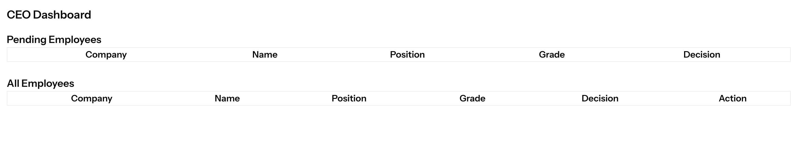

## Project to ...
* This project is to view employees and their details likegardes and decsion and option to edit and decisions through UI

## Tech stack
- PHP 8.2
- Laravel 12 (Vue + Breeze Starter Kit)
- MySQL (via phpMyAdmin)
- Postman (for API testing)
- Vue (UI)

## Screenshot


## Project Architecture

```


app/
├── Contracts/
│   └── EmployeeServiceInterface.php        # Interface for the service
│
├── Services/
│   └── EmployeeService.php                 # Handles all business logic
│
├── Http/
│   ├── Controllers/
│   │   └── Api/
│   │       └── EmployeeController.php      # API controller for frontend AJAX calls
│   │
│   ├── Resources/
│   │   └── EmployeeResource.php            # Optional: for formatting response
│   │
│   └── Requests/
│       └── UpdateEmployeeRequest.php       # Optional: for validation if needed
│
├── Models/
│   └── Employee.php                        # You can create Eloquent models, or use raw queries
│   └── EmployeeGrading.php
│   └── CEODecision.php

routes/
└── api.php                                 # API endpoints

database/
├── migrations/                             # Optional if recreating schema in Laravel
├── seeders/                                # Optional


```


## Funcionalities

- RESTful API to retrieve a list of users
-

## APIs

    GET api/employees/get-empoloyee-details?data=true

    [
    {
        "Company": "A",
        "name": "John Smith",
        "JobDescription": "PHP Developer",
        "Grade": "A",
        "decision": "STAYS AT COMPANY"
    },
    {
        "Company": "A",
        "name": "Russ Douglas",
        "JobDescription": "PHP Developer",
        "Grade": null,
        "decision": null
    },
    {
        "Company": "B",
        "name": "Frank Senatra",
        "JobDescription": "PHP Developer",
        "Grade": "B",
        "decision": null
    },
    {
        "Company": "B",
        "name": "Sam Bark",
        "JobDescription": "JS Developer",
        "Grade": null,
        "decision": null
    },
    {
        "Company": "A",
        "name": "Sean Miller",
        "JobDescription": "JS Developer",
        "Grade": "A",
        "decision": null
    },
    {
        "Company": "A",
        "name": "Rick Zane",
        "JobDescription": "Software Architect",
        "Grade": "F",
        "decision": null
    },
    {
        "Company": "B",
        "name": "Jeff Harvy",
        "JobDescription": "Software Architect",
        "Grade": "C",
        "decision": null
    },
    {
        "Company": "A",
        "name": "Max Vernon",
        "JobDescription": "Support",
        "Grade": "D",
        "decision": null
    },
    {
        "Company": "A",
        "name": "Megan Farl",
        "JobDescription": "Support",
        "Grade": "A",
        "decision": null
    },
    {
        "Company": "B",
        "name": "Ray Paul",
        "JobDescription": "Support",
        "Grade": null,
        "decision": null
    }.....sample response:

    PUT '/{id}


    DELETE '/{id}

## Setup Instructions

1. Clone the repo

    * git clone `<repo-url>`
    * cd myApp

2. Install dependencies:

    * composer install
    * npm install
    * npm run build

2. Create and configure .env file:

    * Set up your MySQL DB
    * Configure DB credentials

4. Run migrations and seed data:

    * php artisan migrate:fresh --seed

5. Serve the app:

    * composer run dev 
    * `or`
    * php artisan serve 

6. Test API with Postman:

        GET http://127.0.0.1:8000/api/v1/users